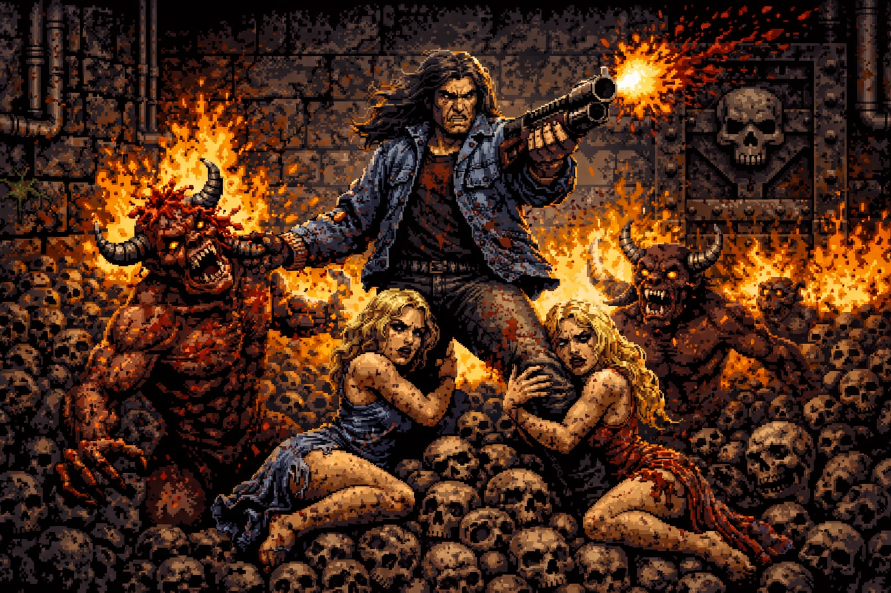

# Cub3D

> **🎮 Playable Doom-like FPS** — Raycasting engine, enemies, combat, doors, HUD, minimap.

---


---

   
 


---

## Project Overview

Cub3D is a 3D game engine inspired by Wolfenstein 3D, built as part of the 42 school curriculum. It features a full raycasting renderer, sprite-based enemies and items, interactive doors, combat mechanics, and a HUD with a real-time minimap.

## Features

### Raycasting Engine
- DDA (Digital Differential Analyzer) ray-wall intersection
- Textured wall rendering (XPM format) with proper orientation (N/S/E/W)
- Flat-color wall fallback if textures fail to load
- Floor and ceiling from RGB values in the map file
- Distance-based shading (walls darken with distance)

### Sprite System
- Billboard rendering (sprites always face the player)
- Ammo pickup sprites (`M` map marker)
- Enemy sprites (`X` map marker) with hit/death blink animation
- Per-scanline door occlusion (sprites render correctly behind partially-open doors)
- View offset compensation for jumping and head bobbing
- Painter's algorithm distance sorting

### Enemies
- Map-based spawning via `X` marker
- Health tracking (50 HP, dies in 3 hits)
- States: IDLE, CHASE, ATTACK, HIT, DEAD
- Collision blocking (player cannot walk through enemies)

### Combat System
- Mouse-click shooting with center-screen hit detection
- Hit zone: 1/10 screen width, respects wall occlusion
- Ammo management (20 starting, 200 max)
- Ammo pickups restore 42 rounds

### Doors
- Map marker: `D`
- Smooth open/close animation with interpolation
- Interaction via `E` key within 1.5 unit range
- Collision blocks when less than 70% open

### Player Mechanics
- WASD + Arrow key movement
- Mouse look with hidden cursor and screen-center wrapping
- Sprint (Shift, 3.5x speed)
- Jump (Space) with parabolic arc
- Head bobbing (sine-wave oscillation when moving)
- Buffer-zone collision detection (walls, doors, enemies)

### HUD
- Bottom bar with health and ammo readouts
- Color-coded values (green/yellow/red thresholds)
- Real-time minimap (player-centered, FOV cone, color-coded cells)

### Weapon
- Gun POV overlay rendered at bottom-center
- Transparent pixel support
- Bob animation synchronized with movement

### Map Parsing
- `.cub` file format with metadata and grid
- Two-pass parsing (dimension counting, then population)
- Comprehensive validation (texture paths, colors, boundaries, characters)
- Player spawn orientation (N/S/E/W)

### Optimizations
- 16.16 fixed-point arithmetic (deterministic, cross-platform)
- Trigonometric lookup tables (0.01° precision)
- FPS-synchronized game loop (60 FPS target)

## Installation

### Prerequisites (Linux)

```bash
sudo apt-get install gcc make xorg libxext-dev
```

### Build

```bash
git clone <repo-url>
cd cub3d
make
```

The Makefile auto-clones libft, poormanfixedpoint, and minilibx-linux if missing.

### Clean

```bash
make clean    # Remove object files
make fclean   # Remove objects + executable
make re       # Clean and rebuild
```

## Usage

```bash
./cuboid <map_file.cub>
```

### Example

```bash
./cuboid maps/test_door.cub
```

## Map File Format

```
NO ./path_to_north_texture
SO ./path_to_south_texture
WE ./path_to_west_texture
EA ./path_to_east_texture

F 220,100,0
C 225,30,0

1111111111111111111111111
1000000000110000000000001
1011000001110000000000001
1001000000000000000000001
111111111011000001110000000000001
... (grid continues)
```

### Map Characters

| Char | Meaning |
|------|---------|
| `NO/SO/WE/EA` | Texture paths for walls |
| `F` / `C` | Floor / Ceiling color (R,G,B) |
| `1` | Wall |
| `0` | Empty space |
| `N/S/E/W` | Player spawn + facing |
| `D` | Door (interactive, animated) |
| `M` | Ammo pickup |
| `X` | Enemy spawn |
| ` ` (space) | Valid empty space |

## Controls

| Key | Action |
| --- | ------ |
| `W` | Move forward |
| `S` | Move backward |
| `A` | Strafe left |
| `D` | Strafe right |
| `←` `→` | Turn left / right |
| `Shift` | Sprint |
| `Space` | Jump |
| `E` | Interact (open/close doors) |
| `LMB` | Shoot |
| `Mouse` | Look around |
| `ESC` | Exit |

## Project Structure

```
cub3d/
├── assets/               # Textures (walls, sprites, weapon)
├── includes/             # 24 header files
├── srcs/
│   ├── main.c            # Entry point
│   ├── init.c            # Game initialization
│   ├── map/              # Map parsing & validation (9 files)
│   ├── player/           # Player movement, drawing (6 files)
│   ├── render/           # Raycasting, textures, sprites, HUD, weapon (38 files)
│   ├── gamelogic/        # Combat, doors, enemies, pickups (9 files)
│   ├── mlx/              # MLX hooks, FPS sync (5 files)
│   ├── cleanup/          # Memory cleanup (3 files)
│   ├── debugging/        # Debug tools (6 files)
│   └── utils/            # Math, trig tables (7 files)
├── extLibs/              # External libs (auto-managed)
├── Makefile
├── ARCHITECTURE.md       # Technical deep-dive
└── *.cub                 # Sample maps
```

## Makefile Targets

| Target | Description |
| ------ | ----------- |
| `make` / `make all` | Build the project |
| `make clean` | Remove object files |
| `make fclean` | Remove objects + executable |
| `make re` | Clean and rebuild |
| `make libft_clean` | Remove libft |
| `make pmfp_clean` | Remove poormanfixedpoint |
| `make mlx_clean` | Remove minilibx |

## Technical Overview

For a comprehensive deep-dive into the engine's design and mathematics, see **[ARCHITECTURE.md](ARCHITECTURE.md)**.

Key technical highlights:

- **Raycasting**: DDA algorithm with per-column rendering, one ray per screen column
- **Fixed-Point Math**: 16.16 format via the `poormanfixedpoint` library for deterministic cross-platform behavior
- **Trig Lookup Tables**: Pre-computed sin/cos tables with 0.01° precision and quadrant-based transformation
- **Sprite Pipeline**: Billboard transform → distance sort (painter's algorithm) → per-scanline door occlusion → view offset compensation
- **Coordinate System**: Custom design with fixed-point ↔ float conversion layers documented in `ARCHITECTURE.md`
- **Memory Management**: Structured cleanup with error-path safety across all systems

## Debugging Tools

- `print_map_array(map)` — Character-by-character map display
- `print_map_grid(map)` — Visual grid representation
- `draw_map_grid(data)` — In-window minimap overlay
- Map validation error reporting

## Resources

- [42 Cub3D Subject](https://cdn.intra.42.fr/pdf/pdf/960/cub3d.en.pdf)
- [MiniLibX Documentation](https://harm-smits.github.io/42docs/libs/minilibx)
- [Lode's Raycasting Tutorial](https://lodev.org/cgtutor/raycasting.html)

## License

MIT License — see [LICENSE](LICENSE).

## Contact

**João Miranda** — joamiran@student.42lisboa.com

---

**Version**: 0.4.2 | **Last Updated**: June 2026
